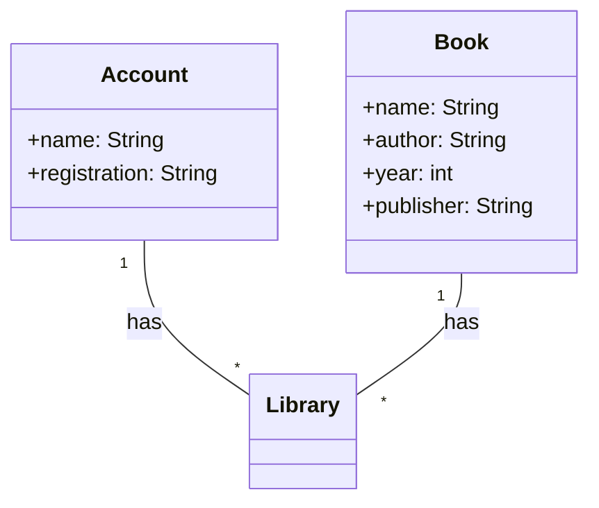

## Diagrama de Classes (Domínio da API)

Neste diagrama de classes, temos três classes principais:

Account: Representa as informações da conta do usuário da biblioteca, incluindo nome e número de registro.

Book: Representa as informações de um livro, incluindo título, autor, ano e editora.

Library: Representa a biblioteca em si, que possui métodos para verificar um livro e devolvê-lo. A biblioteca mantém uma associação com ambas as classes Account e Book, indicando que possui várias contas de usuários e vários livros em seu acervo.

Os relacionamentos são representados por linhas com setas no diagrama:

Account e Book têm uma associação "has" com a classe Library, indicando que a biblioteca possui várias contas de usuários e vários livros.
Este é um diagrama de classes básico que captura o relacionamento entre as entidades relevantes no contexto de empréstimo de livros em uma biblioteca.
